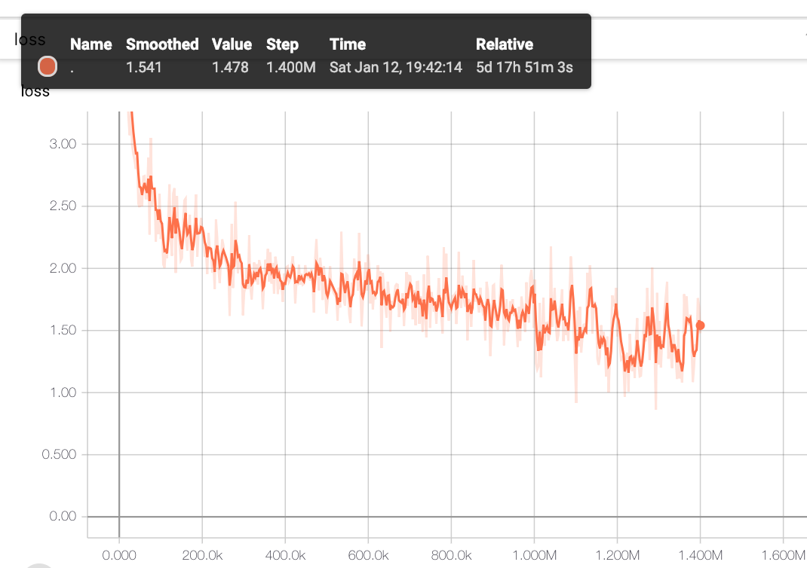

# BERT with SentencePiece for Japanese text.
This is a repository of Japanese BERT model with SentencePiece tokenizer.  

To clone this repository together with the required
[BERT](https://github.com/google-research/bert) and 
[WikiExtractor](https://github.com/attardi/wikiextractor):

    git clone --recurse-submodules https://github.com/yoheikikuta/bert-japanese

## Pretrained models
We provide pretrained BERT model and trained SentencePiece model for Japanese text.
Training data is the Japanese wikipedia corpus from [`Wikimedia Downloads`](https://dumps.wikimedia.org/).  
Please download all objects in the following google drive to `model/` directory.
- **[`Pretrained BERT model and trained SentencePiece model`](https://drive.google.com/drive/folders/1Zsm9DD40lrUVu6iAnIuTH2ODIkh-WM-O?usp=sharing)** 

Loss function during training is as below (after 1M steps the loss function massively changes because `max_seq_length` is changed from `128` to `512`.):


```
***** Eval results *****
  global_step = 1400000
  loss = 1.3773012
  masked_lm_accuracy = 0.6810424
  masked_lm_loss = 1.4216621
  next_sentence_accuracy = 0.985
  next_sentence_loss = 0.059553143
```

## Finetuning with BERT Japanese
We also provide a simple Japanese text classification problem with [`livedoor ニュースコーパス`](https://www.rondhuit.com/download.html).  
Try the following notebook to check the usability of finetuning.  
You can run the notebook on CPU (too slow) or GPU/TPU environments.
- **[finetune-to-livedoor-corpus.ipynb](https://github.com/yoheikikuta/bert-japanese/blob/master/notebook/finetune-to-livedoor-corpus.ipynb)**

The results are the following:
- BERT with SentencePiece
  ```
                  precision    recall  f1-score   support

  dokujo-tsushin       0.98      0.94      0.96       178
    it-life-hack       0.96      0.97      0.96       172
   kaden-channel       0.99      0.98      0.99       176
  livedoor-homme       0.98      0.88      0.93        95
     movie-enter       0.96      0.99      0.98       158
          peachy       0.94      0.98      0.96       174
            smax       0.98      0.99      0.99       167
    sports-watch       0.98      1.00      0.99       190
      topic-news       0.99      0.98      0.98       163

       micro avg       0.97      0.97      0.97      1473
       macro avg       0.97      0.97      0.97      1473
    weighted avg       0.97      0.97      0.97      1473
  ```
- sklearn GradientBoostingClassifier with MeCab
  ```
                    precision    recall  f1-score   support

  dokujo-tsushin       0.89      0.86      0.88       178
    it-life-hack       0.91      0.90      0.91       172
   kaden-channel       0.90      0.94      0.92       176
  livedoor-homme       0.79      0.74      0.76        95
     movie-enter       0.93      0.96      0.95       158
          peachy       0.87      0.92      0.89       174
            smax       0.99      1.00      1.00       167
    sports-watch       0.93      0.98      0.96       190
      topic-news       0.96      0.86      0.91       163

       micro avg       0.92      0.92      0.92      1473
       macro avg       0.91      0.91      0.91      1473
    weighted avg       0.92      0.92      0.91      1473
  ```

## Cautions when using the model as a sentence generation model
The model expects lowercase input and the tokenizer is assumed to be used with `do_lower_case=True` option, but the special tokens such as `[CLS]` are registered in uppercase characters.  
Therefore, when we put `"[CLS] I am ..."` it into the tokenizer as a raw string, the tokenizer first makes it lowercase (`"[cls] i am ..."`) and then cannot interpret `"[cls]"` as the special token, which causes problems.  
If you wanna use the model as a sentence generation model, follow from these steps (sorry, it's a little bit confusing):
- keep special tokens (such as `[CLS]` or `[SEP]`) uppercase
- make original input sentences lowercase manually (e.g., `"i am ..."`)
- join them together (e.g., `"[CLS] i am ..."`) and put it into the tokenizer with `do_lower_case=False` option
- put the obtained tokens into the model

## Pretraining from scratch
All scripts for pretraining from scratch are provided.
Follow the instructions below.

### Environment set up
Build a docker image with Dockerfile and create a docker container.

```
docker build -t bert-ja .
docker run -it --rm -v $PWD:/work -p 8888:8888 bert-ja
```

### Data preparation
Data downloading and preprocessing.
It takes about a few hours on GCP n1-standard-16 (16CPUs, 60GB memories) instance.

```
python3 src/data-download-and-extract.py
bash src/file-preprocessing.sh
```

The above scripts use the latest jawiki data and wikiextractor module, which are different from those used for the pretrained model.
If you wanna prepare the same situation, use the following information:

- bert-japanese: commit `074fe20f33a020769091e1e5552b33867ccbd750`
- dataset: `jawiki-20181220-pages-articles-multistream.xml.bz2` in the [Google Drive](https://drive.google.com/drive/folders/1Zsm9DD40lrUVu6iAnIuTH2ODIkh-WM-O?usp=sharing)
- wikiextractor: commit `1e4236de4237d0a89d0ad7241505d73ee7e23517`

### Training SentencePiece model
Train a SentencePiece model using the preprocessed data.
It takes about two hours on the instance.

```
python3 src/train-sentencepiece.py
```

### Creating data for pretraining
Create .tfrecord files for pretraining.
For longer sentence data, replace the value of `max_seq_length` with `512`.

```
for DIR in $( find /work/data/wiki/ -mindepth 1 -type d ); do 
  python3 src/create_pretraining_data.py \
    --input_file=${DIR}/all.txt \
    --output_file=${DIR}/all-maxseq128.tfrecord \
    --model_file=./model/wiki-ja.model \
    --vocab_file=./model/wiki-ja.vocab \
    --do_lower_case=True \
    --max_seq_length=128 \
    --max_predictions_per_seq=20 \
    --masked_lm_prob=0.15 \
    --random_seed=12345 \
    --dupe_factor=5 \
    --do_whole_word_mask=False
done
```

### Pretraining
You need GPU/TPU environment to pretrain a BERT model.  
The following notebook provides the link to Colab notebook where you can run the scripts with TPUs.

- **[pretraining.ipynb](https://github.com/yoheikikuta/bert-japanese/blob/master/notebook/pretraining.ipynb)**


## How to cite this work in papers
We didn't publish any paper about this work.  
Please cite this repository in publications as the following:

```
@misc{bertjapanese,
  author = {Yohei Kikuta},
  title = {BERT Pretrained model Trained On Japanese Wikipedia Articles},
  year = {2019},
  publisher = {GitHub},
  journal = {GitHub repository},
  howpublished = {\url{https://github.com/yoheikikuta/bert-japanese}},
}
```
